# Inline

Inline is a customer communication platform for modern SaaS teams, inspired by products like Intercom and Crisp.

It combines live chat, AI assistance, knowledge base, analytics, and multi-team collaboration in one modular system.

## Why this repository is public

This organization hosts production and proprietary code in private repositories.

This public repository exists to document architecture, engineering decisions, and product scope without exposing confidential implementation details.

## Product Scope

Inline provides:

- Live chat for websites and applications
- AI assistant for support automation
- Knowledge base and internal documentation tools
- Team inboxes and role-based collaboration
- Analytics and reporting
- Email integration and OTP flows
- Translation workflows
- Embeddable widget SDK

## Architecture Overview

### Frontend

- React
- TypeScript
- Vite
- Redux/Context Style
- Widget isolation via Shadow DOM

### Backend

- WebApi .NET
- Commands like CQRS/MediatR
- PostgreSQL
- Redis
- SignalR for real-time communication

### Infrastructure

- Docker
- Nginx
- GitHub Actions
- Environment-based configuration and deployment pipelines

### Authentication and Security

- JWT access tokens
- Refresh tokens
- HMAC verification for widget and API integrity
- OTP email authentication
- Access and permission boundaries for multi-team scenarios

### Search and AI

- Lucene.NET for indexing and retrieval
- OpenAI integration for assistant flows
- Google Translate integration for multilingual support

## Engineering Goals

This system was built to explore and validate a production-grade SaaS architecture from scratch, with focus on:

- Scalability
- Modular service boundaries
- High performance under real-time load
- Strong domain modeling
- Security-first design
- Multi-tenancy readiness

## Implemented Modules

- Live Chat
- Team Management
- Permissions and Access Control
- Analytics
- Widget SDK
- Email Authentication
- HMAC Authentication
- AI Assistant
- Translation
- Knowledge Base
- Search
- Reporting
- Attachments
- Notifications
- Multi-language support
- Mobile-oriented UX flows

## Repository Structure (Conceptual)

The actual implementation is private, but the platform follows a modular monorepo/service-oriented structure:

- frontend projects
  - ui2 (custom ui library to make lib light weight)
  - shared libraries (to avoid repetable code)
  - widget
  - workspace
  - admin panel
- backend projects
  - auth
  - main
  - search
  - analytics
  - widget
  - admin
  - licensing
  - cleaner
  - database
  - core

## Key Engineering Decisions

Design choices documented in this organization focus on trade-offs, not just technology names:

- Why Commands (CQRS + MediatR) was selected for backend command/query isolation
- Why PostgreSQL + Redis combination was used for consistency + speed
- Why SignalR was chosen for real-time chat transport
- Why Shadow DOM is used in widget embedding scenarios
- Why Lucene.NET was selected for in-app search indexing strategy
- Why HMAC is required for secure widget and request validation

## System Flow (High-Level)

Client App / Website

- Inline Widget
- API Layer
- Auth Service
- Chat and Messaging Services
- Redis (presence/session/cache)
- SignalR (real-time events)
- PostgreSQL (persistent storage)
- Search Index (Lucene.NET)

## Screens and UX Areas

- Dashboard
- Team Inbox / Chat Console
- Widget Conversation View
- Analytics
- Knowledge Base
- Settings and Access Control

## Lessons Learned

- Designing tenant-safe architecture boundaries
- Operating long-lived real-time connections reliably
- Building secure authentication flows for mixed channels
- Optimizing index lifecycle and search relevance
- Structuring large React + TypeScript frontend systems
- Maintaining delivery speed in a multi-service backend

## Roadmap

- AI Copilot workflows
- Voice and omnichannel support
- Mobile SDK expansion
- Webhooks and external automation triggers
- Slack and Microsoft Teams integrations
- Extended audit and compliance tooling

## Project Statistics

Only include values you can verify.

- Started: 2024
- Main Languages: TypeScript, C#, SQL
- Architecture: Monorepo + Multi-service + Multi-tenant
- Implemented Modules: 20+
- Authentication Methods: 3+
- Backend .NET projects (\*.csproj): 14
- Frontend package projects (frontend/packages/\*): 6

## Engineering Journal

This organization will publish architecture notes and technical write-ups, for example:

- Why Commands (CQRS + MediatR) for Inline
- Secure widget design with HMAC authentication
- Building a multi-tenant SaaS platform from scratch
- Lucene.NET decision log and search architecture
- Lessons from real-time chat system design
- Structuring a large React + TypeScript codebase

## Contact

- LinkedIn: [Dzmitry Dym](https://www.linkedin.com/in/dzmitry-dym/)

## Project Dependency Diagrams

These diagrams reflect compile-time references from backend `.csproj` (`ProjectReference`).
Arrows are project dependencies, not runtime network calls.

### Frontend Packages (Context)

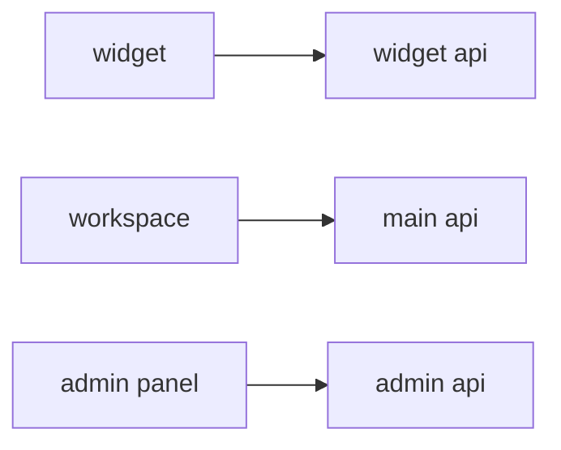

### Backend Projects (Per Project)

#### main api

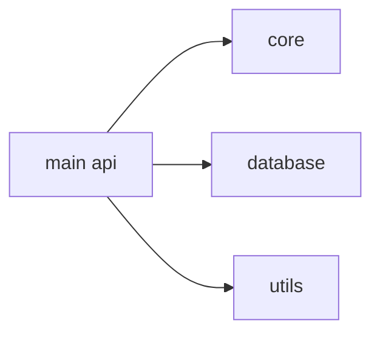

#### auth api

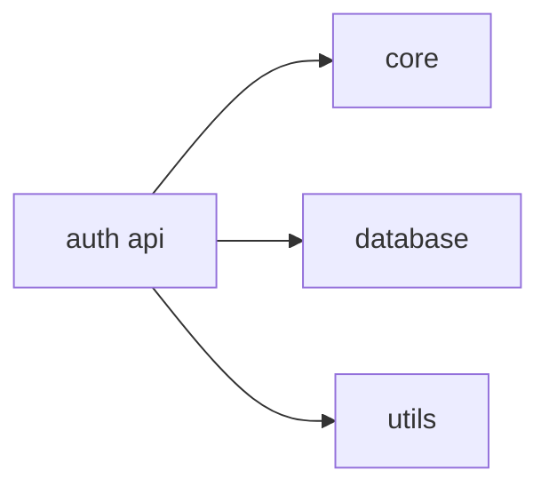

#### admin api

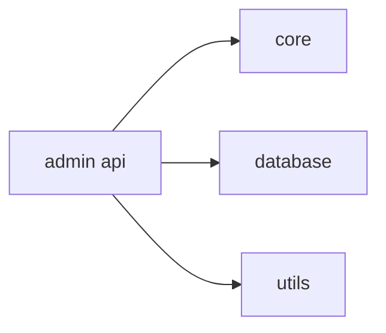

#### search api

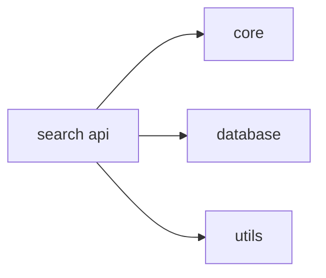

#### widget api

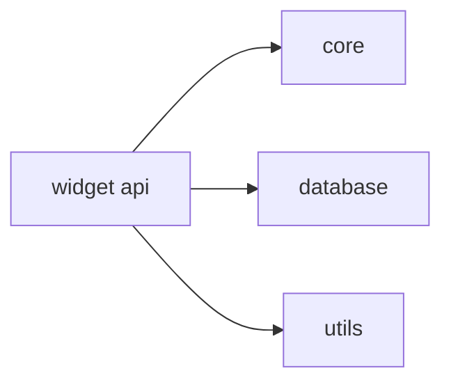

#### licensing api

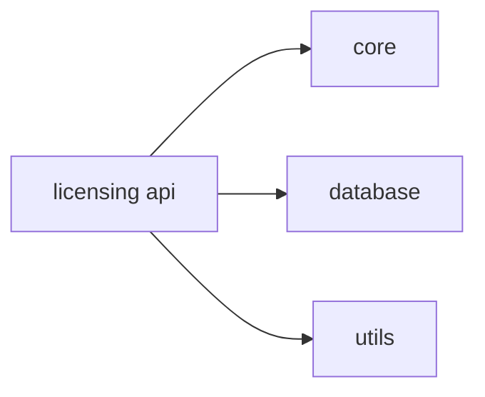

#### cleaner api

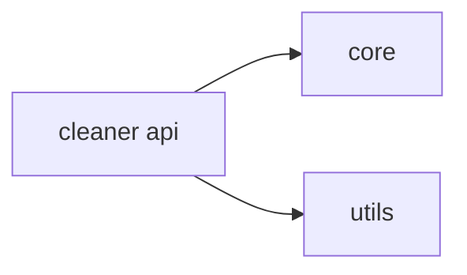

#### radio api

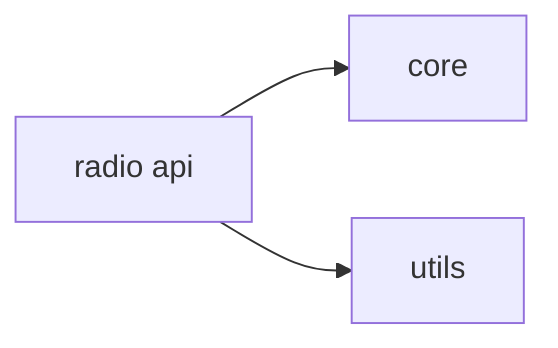

#### core

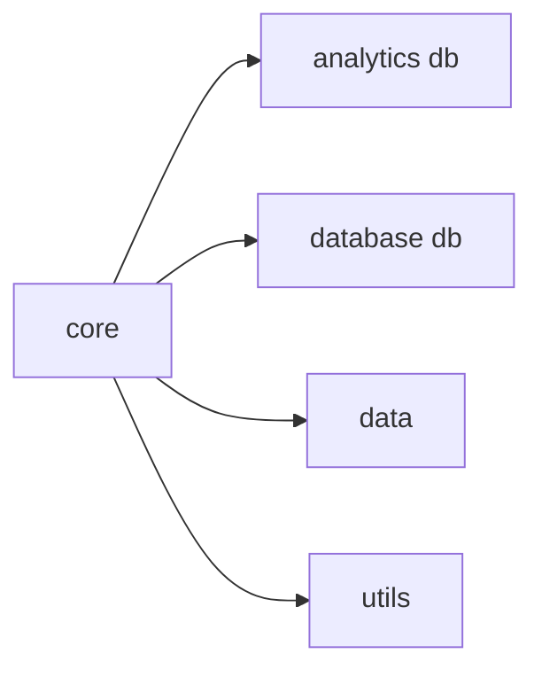

#### database db

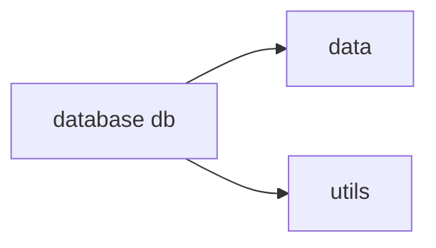

#### analytics db

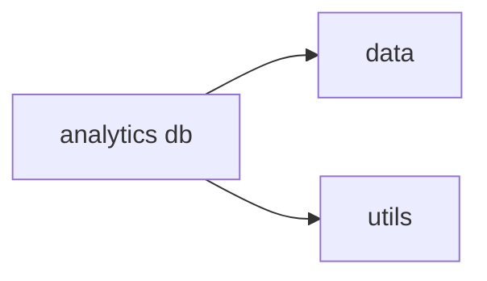

#### data

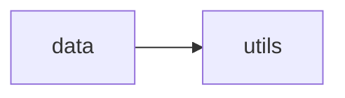

#### utils

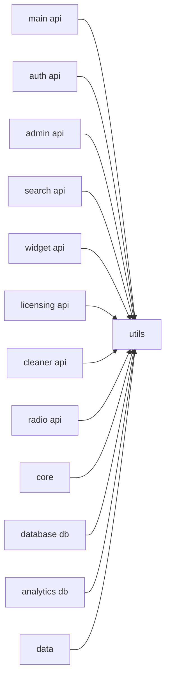
